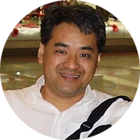
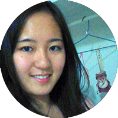

# 
Autores

<!--  DOCENTES -->

  <h3>
    <i class="fa fa-book"></i>
    Docentes
  </h3>

<!-- Cris Lázaro -->

  

    <h4>
      <i class="fa fa-user"></i> 
      Profª Drª Cristiane Alexandra Lázaro
    </h4>
  

  

    

      

        Possui graduação em Bacharelado em Matemática Pura pela Universidade Estadual Paulista Júlio de Mesquita Filho (2002), mestrado em Matemática pela Universidade Estadual Paulista Júlio de Mesquita Filho (2005) e doutorado em Matemática pela Universidade Estadual de Campinas (2008). Tem experiência na área de Álgebra, com ênfase em Álgebra Comutativa, Teoria de Valorizações, Propriedades Homológicas de Finitude de Grupos e Álgebras. Atualmente é professora assistente doutora da Universidade Estadual Paulista Júlio de Mesquita Filho-UNESP.
      

    

  

  

    
    </img>
    

      <h5>
        <a href="http://buscatextual.cnpq.br/buscatextual/visualizacv.do?id=K4736820P6" target="_blank">
          <i class="fa fa-link"></i> 
          Lattes
        </a>
      </h5>  
    

  

<!-- Tatiana Miguel -->

  

    <h4>
      <i class="fa fa-user"></i>
      Profª Drª Tatiana Miguel Rodrigues
    </h4>
  

  

    

      

        Possui graduação em Licenciatura Em Matemática pela Universidade Estadual Paulista Júlio de Mesquita Filho (2000) e mestrado em Matemática pela Universidade Estadual Paulista Júlio de Mesquita Filho (2003), fez doutorado em sistemas dinâmicos simbólicos, área de seu interesse. Atualmente trabalha como professora doutora no departamento de Matemática da UNESP, campus Bauru.
      

    

  

  
  
    
    </img>
      

        <h5>
          <a href="http://buscatextual.cnpq.br/buscatextual/visualizacv.do?id=K4737910P8" target="_blank">
            <i class="fa fa-link"></i> Lattes
          </a>
        </h5>  
      

  

<!-- Wilson Massashiro -->

  

    <h4>
      <i class="fa fa-user"></i>
      Profº Drº Wilson Massashiro Yonezawa
    </h4>
  

  

    

      

        Formação na área de computação (graduação e mestrado). Professor e pesquisador no Departamento de Computação da Faculdade de Ciências da UNESP campus de Bauru-SP. Leciona nos cursos de graduação em Ciência da Computação e Sistemas de Informação. Docente do programa de pós-graduação em Educação para Ciência (mestrado e doutorado). Áreas de interesse: jogos digitais para o ensino de ciências; e-learning, processos de construção de software para educação.
      

    

  

  
  
    </img>
    

      <h5>
        <a href="http://buscatextual.cnpq.br/buscatextual/visualizacv.do?id=K4763799P0" target="_blank">
          <i class="fa fa-link"></i> Lattes
        </a>
      </h5>  
    

  

<!--  DISCENTES -->

  <h3>
    <i class="fa  fa-graduation-cap"></i>
    Discentes
  </h3>

<!-- Bruno Luiz -->

  

    <h4><i class="fa fa-user"></i> Bruno Luiz Gordo Ribeiro</h4>
  

  

    Bacharelado em formação no curso de Ciência da Computação pela UNESP de Bauru, auxiliou na construção do projeto do catálogo online.
  

  
  
    </img>
  

<!-- Deise Hikari -->

  

    <h4><i class="fa fa-user"></i> Deise Hikari Inakura</h4>
  

  

    Estudante em formação no curso de Sistemas de Informação pela UNESP de Bauru, auxiliou na construção do projeto do catálogo online.
  

  
  
    </img>
  

 
